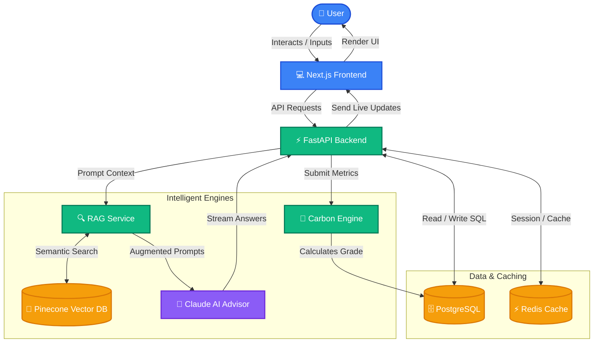

# 🌍 FootprintIQ — Smarter Choices. Smaller Footprints.

[](https://nextjs.org/)
[](https://fastapi.tiangolo.com/)
[](https://cloud.google.com/run)
[](https://www.docker.com/)
[](https://www.anthropic.com/)

**FootprintIQ** is an AI-powered sustainability platform that transforms carbon footprint awareness into actionable change through personalized coaching, predictive modeling, and gamified engagement.

---

## 🏗️ System Architecture & Data Flow

Below is the high-level architecture of FootprintIQ detailing how the user interactively calculates carbon metrics, converses with the AI Sustainability Advisor (powered by RAG and Claude), and tracks their eco-achievements.



---

## 🌟 Core Features

- 🧮 **Carbon Calculator** — A comprehensive 5-category calculation engine (Transportation, Energy, Food, Shopping, Waste) utilizing IPCC-validated emission factors.
- 🤖 **AI Advisor** — A contextual conversational assistant powered by Claude 3.5 and Pinecone Vector DB for Retrieval-Augmented Generation (RAG).
- 🪞 **Eco Twin™** — Simulate potential lifestyle changes (e.g. going vegetarian, purchasing an EV) and view their projected environmental and financial impacts side-by-side.
- 🏆 **Gamification Engine** — Points, achievement badges, levels, and a leaderboard to motivate users to reduce their carbon output.
- 📊 **Interactive Analytics** — Real-time tracking and projection metrics visualized with responsive Recharts graphs.

---

## 🚀 Quick Start (Local Development)

### Prerequisites
- [Docker & Docker Compose](https://www.docker.com/)
- [Node.js 20+](https://nodejs.org/)
- [Python 3.11+](https://www.python.org/)

### 1. Repository Setup
```bash
git clone https://github.com/vikasgupta37/FootprintIQ.git
cd FootprintIQ
```

### 2. Configure Environment Variables
Copy the backend environment variables template and configure your secrets:
```bash
cp backend/.env.example backend/.env
```
Fill in your credentials (e.g., `ANTHROPIC_API_KEY`, `PINECONE_API_KEY`, and Google Client details).

### 3. Spin Up Services locally

#### Option A: Docker Compose (Quickest)
Run the entire stack (PostgreSQL, Redis, Backend, Frontend) with one command:
```bash
docker-compose up --build -d
```
- **Frontend App**: http://localhost:3000
- **FastAPI Documentation**: http://localhost:8000/docs

#### Option B: Standalone Setup

**Backend (FastAPI):**
```bash
cd backend
python -m venv venv
source venv/bin/activate # On Windows: venv\Scripts\activate
pip install -r requirements.txt
uvicorn app.main:app --reload
```

**Frontend (Next.js):**
```bash
cd frontend
npm install
npm run dev
```

---

## ☁️ Cloud Run Deployment (GCP)

This project is configured to build and deploy to Google Cloud Run using Google Cloud Build.

### 1. Authenticate with GCP
```bash
gcloud auth login
gcloud config set project footprintiq-499716
```

### 2. Build and Deploy Backend
```bash
# Submit Build
gcloud builds submit --tag us-central1-docker.pkg.dev/footprintiq-499716/footprintiq/backend:latest ./backend

# Deploy to Cloud Run
gcloud run deploy backend \
  --image us-central1-docker.pkg.dev/footprintiq-499716/footprintiq/backend:latest \
  --region us-central1 \
  --allow-unauthenticated \
  --port 8000 \
  --set-env-vars ENVIRONMENT=development
```

### 3. Build and Deploy Frontend
Ensure the frontend is built using the correct backend API URL argument:
```bash
# Build & Deploy
gcloud builds submit --config=frontend/cloudbuild.yaml ./frontend

gcloud run deploy frontend \
  --image us-central1-docker.pkg.dev/footprintiq-499716/footprintiq/frontend:latest \
  --region us-central1 \
  --allow-unauthenticated \
  --port 3000
```

---

## 📂 Repository Structure

```
FootprintIQ/
├── backend/
│   ├── app/
│   │   ├── api/v1/          # Route controllers (AI, Carbon, Users, etc.)
│   │   ├── core/            # Database config, cache config, security
│   │   ├── models/          # SQLAlchemy schemas
│   │   ├── schemas/         # Pydantic validation structures
│   │   └── services/        # Business logic & AI orchestration
│   ├── tests/               # Pytest suite
│   ├── .gcloudignore        # Cloud Build ignore configuration
│   └── Dockerfile
├── frontend/
│   ├── src/
│   │   ├── app/             # Next.js App Router layout and pages
│   │   ├── components/      # UI components (ShadCN, custom widgets)
│   │   ├── lib/             # API connection clients
│   │   └── stores/          # Zustand client-state stores
│   ├── cloudbuild.yaml      # Custom Cloud Build configuration
│   ├── .gcloudignore        # Cloud Build ignore configuration
│   └── Dockerfile
├── docs/                    # Detailed design/PRD documents
└── docker-compose.yml       # Complete local container orchestration
```

---

## 👥 Contributors & Feedback

Feel free to fork, open pull requests, or submit issues if you want to improve FootprintIQ calculator factors or add new Eco Twin simulations.

Built with 💚 for a sustainable future.
